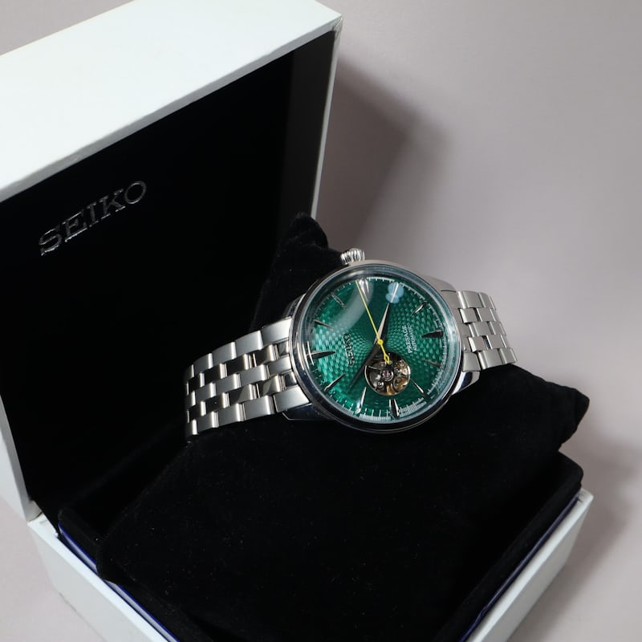

# ⌚ Patel Watch - Premium Watch Store Website

## 🏆 Premium E-Commerce Website for Watch Store in Morbi, Gujarat

A modern, responsive, SEO-optimized website for **Patel Watch** — Morbi's trusted watch store since 2010. Features 3D animations, premium black & gold design, video showcase, and complete business information.

---

## 📋 Table of Contents
- [Features](#-features)
- [Tech Stack](#-tech-stack)
- [File Structure](#-file-structure)
- [Setup Instructions](#-setup-instructions)
- [SEO Optimization](#-seo-optimization)
- [Deployment](#-deployment)
- [Customization](#-customization)
- [Demo Protection](#-demo-protection)
- [Support](#-support)
- [License](#-license)

---

## ✨ Features

### 🎨 Design
- ✅ Premium Black & Gold luxury theme
- ✅ 3D interactive hero background (Three.js)
- ✅ 3D flip cards for watch collection
- ✅ Smooth scroll animations (AOS)
- ✅ Custom cursor effects
- ✅ Fully responsive (Mobile, Tablet, Desktop)
- ✅ Glass morphism effects

### 🛍️ E-Commerce
- ✅ Product catalog with categories
- ✅ Filter by: Luxury, Classic, Sports, Smart
- ✅ WhatsApp "Buy Now" on every product
- ✅ Floating WhatsApp button
- ✅ Price display with discounts

### 📹 Media
- ✅ Video showcase section (Instagram Reel)
- ✅ Image gallery slider (Swiper.js)
- ✅ Watch photos with fallback placeholders
- ✅ Video controls with autoplay

### 💬 Social Proof
- ✅ Customer testimonials carousel
- ✅ Star ratings
- ✅ Counter animations (5000+ customers)
- ✅ 15+ years experience badge

### 📍 Business Info
- ✅ Google Maps integration
- ✅ Complete address with directions
- ✅ Phone number (click to call)
- ✅ Working hours
- ✅ Instagram profile link
- ✅ WhatsApp direct message

### 🔍 SEO
- ✅ Schema.org structured data (JSON-LD)
- ✅ LocalBusiness schema
- ✅ FAQ schema
- ✅ Breadcrumb schema
- ✅ Open Graph meta tags
- ✅ Twitter Cards
- ✅ Sitemap.xml
- ✅ Robots.txt
- ✅ Canonical URL
- ✅ Mobile-friendly

### 🔒 Protection
- ✅ Demo mode with watermark overlay
- ✅ Right-click disabled
- ✅ Keyboard shortcuts blocked
- ✅ DevTools detection
- ✅ Console warnings

---

## 🛠️ Tech Stack

| Technology | Purpose |
|------------|---------|
| **HTML5** | Structure |
| **CSS3** | Styling & Animations |
| **JavaScript (ES6)** | Functionality |
| **Three.js** | 3D Background |
| **Swiper.js** | Sliders & Carousels |
| **AOS.js** | Scroll Animations |
| **Font Awesome** | Icons |
| **Google Fonts** | Typography |
| **Schema.org** | Structured Data |

---

## 🚀 Setup Instructions

### Quick Start
1. **Download/Clone** all files to one folder
2. Add your **watch images** as `watch1.jpg` to `watch6.jpg`
3. Add your **video** as `patel_watch_reel.mp4`
4. Open `index.html` in any browser — **Done!** ✅

### For Production
1. Replace all `https://patelwatch.com` with your **actual domain**
2. Update **Google Maps** iframe with correct coordinates
3. Verify **Google Search Console** ownership
4. Submit `sitemap.xml` to Google
5. Create **Google Business Profile**
6. Deploy to hosting server

### Changing Images
- Replace `watch1.jpg` through `watch6.jpg` with your own watch photos
- Recommended size: **800x1000px** (portrait)
- Format: **JPG/WebP** (compress before upload)

### Changing Video
- Replace `patel_watch_reel.mp4` with your Instagram reel
- Format: **MP4** (H.264 codec)
- Recommended size: Under **20MB** for fast loading

---

## 🔍 SEO Optimization

### Meta Tags Checklist
- [x] Title tag (60 characters)
- [x] Meta description (160 characters)
- [x] Keywords meta tag
- [x] Open Graph tags (Facebook/WhatsApp)
- [x] Twitter Card tags
- [x] Canonical URL
- [x] Robots meta tag

### Structured Data
- [x] LocalBusiness schema
- [x] FAQ schema (4 questions)
- [x] Breadcrumb schema
- [x] Product Offer catalog
- [x] Geo coordinates
- [x] Opening hours
- [x] Aggregate rating

### Files for SEO
- [x] `sitemap.xml` — Submit to Google Search Console
- [x] `robots.txt` — Crawling instructions
- [x] `.htaccess` — HTTPS redirect, caching, compression

### Keywords Targeting
